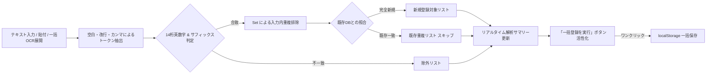

# SoraScan アーキテクチャ & 詳細設計書

本書では、日向坂46シリアルナンバー自動抽出・登録管理アプリ **「SoraScan」** の内部アーキテクチャ、画像解析パイプライン、データ構造、および拡張方針について詳細に解説します。

---

## 1. システム全体構成

SoraScan は、端末内ですべてのデータ処理・永続化を完結できる **完全クライアントサイド型 PWA（Progressive Web App）** を基盤としつつ、Google Gemini APIによるクラウド高精度画像解析（BYOK: Bring Your Own Key方式）をシームレスに統合したハイブリッド設計です。

また、アプリ起動時は初期表示タブとして **「シリアル一覧（`viewList`）」** を採用しています。起動時の不要なカメラ起動や電力消費を抑え、登録済みシリアルの残数確認や一括登録作業に即座に入ることができます。

```mermaid
graph TD
    subgraph UI_Layer [プレゼンテーション層]
        DOM[HTML5 UI / View Panels]
        InitView[初期表示: シリアル一覧 viewList]
        BatchModal[一括登録モーダル & プレビュー]
        NativeCam[背面高画質カメラ capture=environment]
        Theme[日向坂46 空色デザインシステム]
        Nav[ボトムナビゲーション & モーダル]
    end

    subgraph Core_Engine [コア解析エンジン]
        Cam[MediaDevices API / Live Camera]
        Preprocess[Canvas 画像前処理パイプライン]
        OCR[Tesseract.js v5 - 単一券面OCR]
        QR[jsQR - リアルタイム検知]
        MultiOCR_Gemini[Gemini 3.5 Flash-Lite - 複数一括OCR]
        MultiOCR_Tess[Tesseract.js SPARSE_TEXT - 複数フォールバック]
        BatchParser[一括テキストパーサー & サフィックス判定]
        Parser[正規表現パーサー & 誤読補正]
    end

    subgraph Cloud_AI [クラウドAI (BYOK)]
        GeminiAPI[Google Gemini API / gemini-3.5-flash-lite]
    end

    subgraph Data_Layer [データ永続化層]
        StorageMgr[Storage Manager]
        LocalDB[(localStorage / IndexedDB)]
        Exporter[CSV / JSON 出力]
    end

    DOM -->|単一スキャン| Cam
    DOM -->|一括写真撮影| NativeCam
    DOM -->|一括テキスト入力| BatchParser
    Cam -->|Video Stream| Preprocess
    Cam -->|Frame Sampling| QR
    Preprocess -->|二値化クロップ画像| OCR
    NativeCam -->|高解像度写真| MultiOCR_Gemini
    NativeCam -.->|オフライン時| MultiOCR_Tess
    MultiOCR_Gemini <-->|JSON Structured Output| GeminiAPI
    MultiOCR_Gemini --> BatchParser
    MultiOCR_Tess --> BatchParser
    OCR --> Parser
    QR --> Parser
    Parser -->|正規化シリアル| StorageMgr
    BatchParser -->|重複排除 & 有効シリアル群| StorageMgr
    StorageMgr --> LocalDB
    StorageMgr --> Exporter
    StorageMgr --> DOM
```

---

## 2. 画像解析 & OCRパイプライン詳細

### ① スキャン領域の自動クロッピング（ROI: Region of Interest）
画面全体をOCRにかけると、背景の不要な文字やノイズを拾って誤認識の原因となり、また処理時間も長くなります。
SoraScan では、画面上のガイド枠（`.target-box`）の座標を `getBoundingClientRect()` で取得し、カメラ映像の解像度との比率を計算して**シリアル券面の中央領域のみをピンポイントで切り抜きます**。

```javascript
// クロップ座標の計算例 (scanner.js)
const scaleX = naturalW / vRect.width;
const scaleY = naturalH / vRect.height;
const sx = Math.max(0, (oRect.left - vRect.left) * scaleX);
const sy = Math.max(0, (oRect.top - vRect.top) * scaleY);
const sWidth = Math.min(naturalW - sx, oRect.width * scaleX);
const sHeight = Math.min(naturalH - sy, oRect.height * scaleY);
```

### ② 画像前処理（フィルタリング & 二値化）
カメラで撮影した写真は、照明の影やグラデーション背景、印刷の反射によって文字のコントラストが低下します。Tesseract.js に入力する前に、HTML5 Canvas 上で以下のパイプラインを実行します：

1. **解像度スケーリング**: 文字認識に最適な幅（1000px〜1600px）に正規化。
2. **Rec. 709 グレースケール変換**:
   $$\text{Luminance} = 0.2126 \times R + 0.7152 \times G + 0.0722 \times B$$
3. **輝度ヒストグラム解析**: 画像内の最大輝度（$L_{\max}$）と最小輝度（$L_{\min}$）を動的に測定。
4. **適応的二値化**:
   $$\text{Threshold} = L_{\min} + (L_{\max} - L_{\min}) \times 0.48$$
   閾値以下のピクセルを純黒（0）、それ以外を純白（255）に変換することで、**日向坂46の青空グラデーション背景を完全に除去し、黒い印字文字だけをくっきりと浮き上がらせます**。

### ③ Tesseract.js Worker の最適化パラメータ
文字認識エンジンには以下のホワイトリストとページセグメンテーションモード（PSM）を適用しています：

| パラメータ | 設定値 | 効果・理由 |
| :--- | :--- | :--- |
| `tessedit_char_whitelist` | `0123456789ABCDEFGHIJKLMNOPQRSTUVWXYZ` | 英大文字・数字のみに完全限定（ハイフン除去） |
| `tessedit_pageseg_mode` | `SINGLE_BLOCK` (6) | シリアル文字列ブロックを高精度に検出 |

### ④ シリアル抽出の正規表現パターン（日向坂46公式 14文字仕様）
抽出されたテキストから、以下の優先順位でシリアルコードを判定します：

1. **完全一致 14文字英数字**: `/\b[A-Z0-9]{14}\b/g`（スコア 100）
2. **URLパラメータ（QRコード）**: `[?&](?:code|serial|ticket|c)=([A-Z0-9]{14})`（スコア 100）
3. **行内スペース除去後 14文字**: 単語間にスペースが入ってしまった場合（例: `A8B3 2K9M 4P7W 1X`）を連結（スコア 98）
4. **15文字以上からの14文字部分抽出**: 前後の記号ゴミを削ぎ落としてスライディング抽出（スコア 88〜92）

### ⑤ アルバム共通サフィックス（末尾2文字）を活用したハイブリッド誤認識防止・自動補正機構
日向坂46（および坂道シリーズ）の封入シリアルナンバーは、**同一シングル・アルバム（作品）であれば末尾2文字がすべて同一の固定文字列（サフィックス）**になっています（例: 18th『イチャイチャ虫』はすべて `TN`）。
SoraScanではこの事前知識（Prior Knowledge）を最大限に活用し、以下の三重防御パイプラインで認識精度を劇的に向上させています：

1. **スコアリングボーナス（+35点）**:
   抽出候補の中で末尾2文字が作品の固定サフィックスと一致するものを最優先にランク付け。
2. **OCR混同文字テーブルによる末尾自動誤読補正（Suffix Error Correction）**:
   文字のかすれやフォント形状により `N` が `M` や `H`、`T` が `1` や `I` や `7` などに誤読された場合、末尾を作品の固定サフィックスに置換した補正候補を自動生成して優先採用。
3. **アライメント境界救済**:
   前後のノイズで15文字等に膨らんだ場合も、行内に含まれるサフィックス位置をアンカーとして正規の14文字を精緻に切り出し。
4. **Gemini Vision AIへのプロンプト注入**:
   マルチモーダルAI解析時にも「末尾2文字の確定ルール」を指示し、精度を100%に近づけます。
5. **スマート自動学習（Auto-Inference）**:
   作品設定で未入力の場合でも、登録されたシリアルコードの末尾から作品サフィックスを自動推定・記憶。

### ⑥ 複数券面の一括画像解析パイプライン（机に並べた10〜20枚の一括抽出）
机や床の上に10〜20枚の応募券を並べて撮影した広角写真から、画像内のすべてのシリアルコードを一度に抽出するハイパフォーマンスパイプラインです。

```mermaid
graph TD
    User([ユーザー: 机に10〜20枚並べて撮影]) --> CaptureMode{入力手段の選択}
    CaptureMode -->|カメラで撮影| NativeCam[OS標準背面カメラ capture=environment]
    CaptureMode -->|写真を選択| AlbumPicker[端末アルバム画像 input type=file]

    NativeCam --> MaxResImage[フル画素・オートフォーカス高精細JPEG]
    AlbumPicker --> MaxResImage

    MaxResImage --> CheckAPIKey{Gemini APIキーの有無}

    subgraph Gemini_Route [Gemini 3.5 Flash-Lite パイプライン (推奨・超高速)]
        CheckAPIKey -->|APIキーあり| PromptGen[作品サフィックス注入 & JSONスキーマ指示]
        PromptGen --> GeminiCall[POST /v1beta/models/gemini-3.5-flash-lite:generateContent]
        GeminiCall --> JSONParser[JSON配列抽出 & 文字列正規化]
        JSONParser --> SuffixFix[末尾2文字類似判定 & isSuffixNearMatch補正]
    end

    subgraph Tesseract_Route [端末内OCR フォールバック]
        CheckAPIKey -->|APIキーなし / オフライン| TessConfig[PSM.SPARSE_TEXT 11 / AUTO 3 設定]
        TessConfig --> TessExec[Tesseract.js recognize 実行]
        TessExec --> TessParser[全テキストから14桁正規表現スライディング抽出]
    end

    SuffixFix --> BatchTextarea[一括登録モーダルのテキストエリアへ自動展開]
    TessParser --> BatchTextarea
    BatchTextarea --> LiveSummary[リアルタイム解析サマリー & 重複事前判定]
```

1. **OS標準高画質カメラの直接呼び出し（`<input type="file" capture="environment">`）**:
   - WebRTC（`getUserMedia`）によるリアルタイム映像取得は、ブラウザ側の解像度制限（一般に 1080p 程度）、オートフォーカス追従の弱さ、および非HTTPS環境でのアクセス制限という課題があります。
   - 本パイプラインでは `<input type="file" capture="environment">` を採用。スマートフォンのOS標準カメラアプリを直接起動し、**超高画素（1200万〜4800万画素）・高速オートフォーカス・自動HDR** をフル活用した撮影が可能です。広角写真の中に小さく写った10〜20枚のシリアル英数字でも、ピントの合った鮮明な画像として取得できます。
2. **Gemini 3.5 Flash-Lite によるマルチシリアル一括抽出（Structured Output）**:
   - 2026年時点の最新高効率モデル **`gemini-3.5-flash-lite`** を採用。入力トークン単価 $0.30/1M tokens という圧倒的な低コストと、1秒台の超高速レスポンスを両立しています。
   - **Structured Output（構造化JSON）**: `responseMimeType: 'application/json'` を指定し、Geminiに純粋なJSON文字列配列形式（`["SERIAL1", "SERIAL2", ...]`）で返却させます。
   - **作品サフィックス情報の動的注入**: プロンプトに対象作品の末尾2文字（例: `TN`）をプロンプト変数として埋め込み、AIに対して「末尾2文字は必ず『TN』である」という強い事前知識を与えます。これにより、極小フォントや影でかすれた文字でも類似文字誤読（`B` と `8`、`S` と `3`、`0` と `O`、`I` と `1` 等）をフォント形状から極めて高精度に見分けます。
   - **クライアントサイド安全補正**: AIからの返却後、正規表現による14文字検証に加え、万一末尾が1文字ずれている場合でも `isSuffixNearMatch` により自動救済を行います。
3. **端末内OCR（Tesseract.js）マルチシリアルフォールバック**:
   - Gemini APIキーが未設定、または機内モード・通信不可の環境では、端末内 Tesseract.js Worker（`initTesseract()`）が自動的にフォールバックとして作動します。
   - 複数券面が画面内に散在するレイアウトに対応するため、ページセグメンテーションモードを **`PSM.SPARSE_TEXT` (11)** または **`PSM.AUTO` (3)** に設定。画像内の全テキストから正規表現 `/\b[A-Z0-9]{14}\b/g` および空白除去トークンから14文字英数字をスライディング抽出します。

---

## 3. シリアルナンバー一括登録 & 重複排除パイプライン

外部ツール、バーコードリーダー、PCのテキストメモ、および上記の「机に並べた写真一括OCR」から渡された複数シリアルを安全・確実に一括取り込みする機構です。



### ① 柔軟なマルチデリミタ・パーサー
入力テキスト内の区切り文字は問わず、**改行、半角・全角スペース、カンマ（`,`）、タブ（`\t`）** で自動分割されます。
シリアルコード以外の前後のゴミ文字列（説明文やヘッダー）が含まれていても、正規表現 `\b[A-Z0-9]{14}\b` によって14文字の英数字コードのみを正確にスライス抽出します。

### ② 二重重複排除（Two-Stage Deduplication）
1. **入力テキスト内重複排除**: 同一のシリアルがテキスト内に2回以上出現した場合、`Set` を用いて1件に自動マージします。
2. **登録済みDBとの照合スキップ**: すでに `localStorage` に保存済みのシリアルと照合し、重複しているものは自動的に「既存重複（スキップ）」として分類。新規シリアルのみを安全に追加登録します。

### ③ 作品サフィックスによる厳格なバリデーション
選択中の作品に末尾2文字（例: `TN`）が設定されている場合、末尾が一致しない14桁コードは「除外（桁/末尾不一致）」としてカウントされ、誤って別シングルのシリアルが混入する事故を防ぎます。

### ④ 盤種・形態の除外設計
ユーザーアンケートおよび実用性検証に基づき、一括登録フローでは「Type-A / Type-B等の盤種選択」をあえて要求しません。日向坂46のCD封入シリアルは全盤共通で同一の応募枠に利用できるため、不要な入力ステップを排除して最速の一括登録を実現しています。

---

## 4. データモデル（スキーマ設計）

ローカルストレージ（キー: `sorascan_serials_v1` および `sorascan_campaigns_v1`）に保存されるレコードの仕様です。

```typescript
interface CampaignRecord {
  id: string;              // 固有ID (例: "camp_18th_single")
  title: string;           // 作品名 (例: "日向坂46 18thシングル『イチャイチャ虫』")
  shortTitle: string;      // 短縮通称 (例: "18th「イチャイチャ虫」")
  serialSuffix: string;    // アルバム共通のシリアル末尾2文字 (例: "TN")
  applyUrl: string;        // 公式応募サイトURL
  period: string;          // 応募期間
  createdAt: string;       // ISO 8601
}

interface SerialRecord {
  id: string;              // 固有ID (例: "sn_1727678400000_x9a2b")
  serial: string;          // 正規化されたシリアルコード (ハイフンなし大文字英数14文字)
  rawText: string;         // OCR/QRで抽出された生テキスト
  type: string;            // 盤種 ("Type-A" | "Type-B" | "Type-C" | "Type-D" | "通常盤" | "アルバム" | "" 一括登録時は空文字)
  campaignId: string;      // 紐付く作品ID
  campaignTitle: string;   // 紐付く作品名
  singleTitle: string;     // 作品名 (後方互換用)
  applyUrl: string;        // 応募URL
  status: 'unused' | 'used'; // 応募ステータス ('unused': 未応募, 'used': 応募済)
  scanMethod: 'ocr' | 'qr' | 'manual' | 'simulator' | 'batch_import'; // 登録手段
  createdAt: string;       // ISO 8601 登録日時
  usedAt: string | null;   // ISO 8601 応募完了日時
  note: string;            // ユーザーメモ（応募枠、ミーグリ部数等）
}
```

### 重複判定（Deduplication）ロジック
- 保存時、`normalizeSerial()` 関数によってすべてのハイフン・空白・アンダースコアを除去し、英大文字に統一します。
- 既存の全レコードの `serial` と比較し、1件でも一致すれば重複とみなし、警告表示または連続スキャン時の登録スキップを行います。

---

---

## 5. エクスポート仕様

### CSV エクスポート
- **エンコーディング**: UTF-8 with BOM (`\uFEFF`)
  - ※BOMを付与することで、日本のWindows版Microsoft Excelでダブルクリックしても**文字化けすることなく**正常に日本語・シリアルが開けます。
- **カラム構成**:
  `シリアルナンバー, ステータス, 形態・盤種, 対象作品, 登録方式, 登録日時, 使用日時, メモ`
- シリアルナンバーは視認性を高めるため `XXXX-XXXX-XXXX-XXXX` の4文字ハイフン区切りでフォーマットされます。

### JSON バックアップ
- 全レコードの完全な配列をJSONとしてダウンロード可能。
- 復元（インポート）時は、既存のシリアルとの重複を自動で検知し、未登録のシリアルのみを安全に追加マージします。

---

## 6. UI/UX & PWA 実装詳細

### 初期表示の最適化（シリアル一覧タブ優先）
従来のカメラ自動起動型スキャナーと異なり、起動時は「シリアル一覧」パネルをアクティブ表示します。
これにより、カメラデバイスの初期化オーバーヘッド（起動遅延、バッテリー消費、不要な権限要求）を回避し、シリアル残数確認やテキスト一括登録・写真一括撮影をスムーズに開始できます。

### グラスモーフィズム（Glassmorphism）
```css
background: rgba(18, 33, 60, 0.75);
border: 1px solid rgba(255, 255, 255, 0.16);
backdrop-filter: blur(20px);
-webkit-backdrop-filter: blur(20px);
```
- 背景の深い青空ネイビーと光のグラデーションの上に、半透明のカードを配置。
- スマートフォンのSafariおよびChromeで滑らかにレンダリングされます。

### 音響＆触感フィードバック
- **Web Audio API**: 音声ファイル（MP3等）を外部ロードせず、ブラウザ内蔵のオシレーター（`OscillatorNode`）で純音の正弦波（D5 587Hz → A5 880Hz）を合成し、遅延ゼロで心地よいピンポンチャイムを再生。
- **Vibration API**: `navigator.vibrate([40, 50, 40])` により、Android等の端末で小気味よい触感フィードバックを提供。

---

## 7. 応募サイト自動登録アーキテクチャ（Auto-Apply System）

日向坂46のCD封入抽選応募特設サイト（**forTUNE meets** 等）へのシリアル登録作業を自動化・劇的に効率化するための連携機構です。

```mermaid
graph TD
    subgraph SoraScan_PWA [SoraScan PWA 本体]
        UnusedList[(未応募シリアル一覧)]
        Modal_AutoApply[自動登録アシスタント]
        Sequencer[タブ復帰連動シーケンサー]
    end

    subgraph Target_Site [公式応募サイト (forTUNE meets / 模擬)]
        Floating_UI[スマホ向け 空色フローティング操作バー]
        Input_Field[シリアル入力欄 (input#serial_code)]
        Submit_Btn[登録ボタン (button[type=submit])]
        Result_State[完了検知 (DOM監視)]
    end

    UnusedList -->|データセット / クリップボード| Modal_AutoApply
    Modal_AutoApply -->|ブックマークレット生成| Floating_UI
    Modal_AutoApply -->|順次コピー| Sequencer

    Floating_UI -->|仮想DOM対応値注入| Input_Field
    Input_Field --> Submit_Btn
    Submit_Btn --> Result_State
    Result_State -->|1.5秒待機後に次へ自動送信| Floating_UI

    Sequencer -.->|タブ切り替え検知で次シリアル自動コピー| Target_Site
```

### ① スマホ特化型 ブックマークレット（`js/bookmarklet.js`）
- **クロスオリジン制約の突破**:
  ブラウザの同一生成元ポリシー（Same-Origin Policy）により、外部Webサイトから `ticket.fortunemeets.app` のDOMを直接操作することは禁止されています。
  SoraScanでは、応募サイトのコンテキスト内で直接実行される**ブックマークレット（JavaScript URL）**を動的生成することで、安全かつ完全にフォーム操作・自動送信を実行します。
- **forTUNE meets 公式「最大10件 一括まとめ打ち」対応**:
  実際のforTUNE meets登録画面（`#/registration`）は、初期状態で3つの入力枠（`#inputSerial1`〜`#inputSerial3`）があり、「＋ 入力枠を追加」ボタンで最大10枠まで追加できる仕様となっています。
  SoraScanのブックマークレットは、未応募シリアルの件数（例: 5件）に応じて**「＋ 入力枠を追加」ボタンを自動連打して枠数を拡張し、最大10件のシリアルを一気に全枠へ流し込んで一発登録**します。1件ずつ送信する従来型と比べて**10倍以上の超高速化**を実現しています。
- **React / 仮想DOMのプロパティセッター・バイパス**:
  現代のWebフォーム（React/Vue等）は、JavaScriptで `input.value = "..."` を代入しただけでは内部のステートが更新されず、登録ボタンが活性化しません（`pointer-events: none` のまま）。
  SoraScanのインジェクションコードでは、プロトタイプチェーンからネイティブのセッターを取得して実行し、`input` および `change` イベントを強制バブリング発火させることで、**Reactの内部stateを即座に更新し、登録ボタンを緑色（活性化）へ導きます**。
  ```javascript
  const nativeSetter = Object.getOwnPropertyDescriptor(window.HTMLInputElement.prototype, 'value')?.set;
  if (nativeSetter) {
    nativeSetter.call(input, serial);
  } else {
    input.value = serial;
  }
  input.dispatchEvent(new Event('input', { bubbles: true }));
  input.dispatchEvent(new Event('change', { bubbles: true }));
  ```
- **シリアル登録画面直行ルーティング（`#/registration`）**:
  トップページから手動で探す必要をなくすため、`getDirectRegistrationUrl()` によって自動的に `#/registration` 付きのURLを開き、開いた瞬間にシリアル入力画面へ着地させます。
- **サーバー負荷対策と安全ディレイ（Rate-Limiting Protection）**:
  全自動連続登録（Auto-Run）時は、登録完了画面をMutationObserverおよびDOM走査で検知した後、**2秒の安全待機インターバル**を必ず挟んでから次の10件バッチへ遷移します。これにより公式サーバーへのDoS的負荷や一時的なIP制限を確実に防ぎます。

### ② タブ復帰連動型 シーケンサー（ゼロ設定アシスト）
- ブックマークの登録すら不要な、標準ブラウザ機能（`Page Visibility API` / `Window Focus`）を活用したアシスタントです。
- SoraScanから「シーケンサー開始」を押すと1件目をコピーして別タブでシリアル登録画面（`#/registration`）を開きます。
- ユーザーが応募サイトでペースト・送信を行い、**SoraScanのタブに戻るだけ（`visibilitychange` または `focus` イベント検知）で、直前のシリアルが自動で「応募済」になり、次のシリアルが即座にクリップボードに自動コピー**されます。
- 「戻る → ペースト → 戻る → ペースト」の反復が一切の無駄な操作なく最短ステップで完了します。

### ③ 模擬応募サイト（`mock-apply.html`）
- 本物の `registration.htm` のHTML構造・CSS（3つの初期枠、10個までの枠追加ボタン、シリアルナンバー登録ボタンの活性化、14桁バリデーション、完了通知）を100%忠実にシミュレートしたテスト環境です。いつでも本番と寸分違わぬ動作検証が可能です。

---

## 8. トラブルシューティング & FAQ

### Q. 机に並べた写真を撮影してもシリアルが認識されない／件数が少ない
**【対策】**
1. **Gemini APIキーの登録**: 無料枠で利用可能なGoogle Gemini APIキーを設定画面または一括登録モーダル内のバナーから入力してください。AI（`gemini-3.5-flash-lite`）によるマルチモーダル解析が有効になり、10〜20枚の小さな券面文字でも一括で高精度抽出できるようになります。
2. **券面の間隔とピント**: 券同士が重なり合わないよう、少し隙間（1cm程度）をあけて平らに並べてください。また、スマホの影がシリアル文字に落ちないよう、斜め上や明るい照明の下でピントを合わせて撮影してください。
3. **対象作品サフィックスの確認**: 対象作品の末尾2文字（例: 18thなら `TN`）が正しく設定されているか確認してください。末尾が異なるコードは除外対象となります。

### Q. 「This model models/gemini-2.0-flash is no longer available」とエラーが出る
**【原因・対策】**
旧モデル（`gemini-2.0-flash`）は提供終了となりました。SoraScanの最新実装では、最新の高効率モデル **`gemini-3.5-flash-lite`** に移行済みです。アプリを再読み込み（リロード）して最新版をご利用ください。

### Q. Android端末で「カメラの起動に失敗しました」と表示される
**【原因】Web標準のセキュリティ仕様（Secure Context制限）**
近年のブラウザ（Chrome, Edge, Safari）では、**セキュリティ保護のため「HTTPS」または「localhost」以外の環境（例: `http://192.168.x.x:5173/`）では、カメラAPI（`getUserMedia`）へのアクセスが強制的に無効化**されます。

#### 💡 解決策 1: Android ChromeのフラグでローカルIPを許可する（最速・おすすめ！）
AndroidのChromeブラウザで以下の設定を行うと、ローカルIPをHTTPSと同等の安全なオリジンとして扱い、カメラが即座に起動します。

1. Android端末のChromeを開き、URLバーに **`chrome://flags`** と入力して開く
2. 検索バーに **`Insecure origins treated as secure`** と入力
3. 該当の項目を **「Enabled」** に切り替える
4. 下のテキストボックスに、アクセスしているPCのURL（例: **`http://192.168.1.100:5173`**）を入力する
5. 画面右下の **「Relaunch」** ボタンを押してChromeを再起動する
6. アプリを開き直すと、カメラへのアクセス許可ダイアログが表示され、正常に起動します！

#### 💡 解決策 2: 「アルバム写真から選択」または「📸 カメラで撮影」を利用する（設定不要・即可能）
「机に並べて一括撮影・OCR登録」や「📸 カメラで撮影」ボタン（`<input type="file" capture="environment">`）をタップすると、ブラウザのセキュリティ制限を受けずに**Androidの標準カメラアプリが直接起動**します。撮影した写真はそのままSoraScanのOCRエンジンに送られてシリアルが抽出されます。

#### 💡 解決策 3: HTTPSローカルサーバーで起動する
自己署名SSL証明書、またはトンネリングツール（`cloudflared`, `ngrok`, `localtunnel` 等）を利用して `https://` 経由でアクセスします。

---

| 症状 | 原因 | 対処法 |
| :--- | :--- | :--- |
| 机に並べた写真の認識率が低い | 端末内OCRでの解像度・文字散在処理限界 | 無料のGemini APIキーを設定して `gemini-3.5-flash-lite` を有効化してください。 |
| 「カメラの起動に失敗しました」（Android） | 非HTTPS（`http://192.168.x.x`）でのアクセス制限 | 上記の「解決策1（`chrome://flags`）」または「解決策2（カメラで撮影・アルバム写真）」を行ってください。 |
| カメラの使用が拒否されました | ブラウザのサイト設定でカメラがブロックされた | アドレスバー左側の「🔒（鍵アイコン）」またはサイト設定を開き、カメラを「許可」に変更して再読み込みしてください。 |
| 「0」と「O」「3」と「S」が誤認識される | 券面のフォントによる類似 | 確認モーダルのワンタップ置換ボタン（「O → 0」「S → 3」等）を押すか、直接手動で修正してください。 |
| 一括登録で盤種（Type-A等）が設定されない | 登録スピード優先の意図的な仕様 | CD封入シリアルは全盤共通で使用可能なため、一括登録時は盤種選択を不要としています。個別編集からメモや盤種を後から追記可能です。 |
| OCRの認識に時間がかかる | 初回ロード時のTesseract学習データ読み込み | 初回認識時のみCDNから言語データ（約2MB）をダウンロードするため数秒かかります。2回目以降はキャッシュされ高速化します。 |
| QRコードが読み取れない | 反射またはピントが合っていない | 券面に対してスマホを少し離し、照明の反射がQRコードに重ならない角度に調整してください。 |

