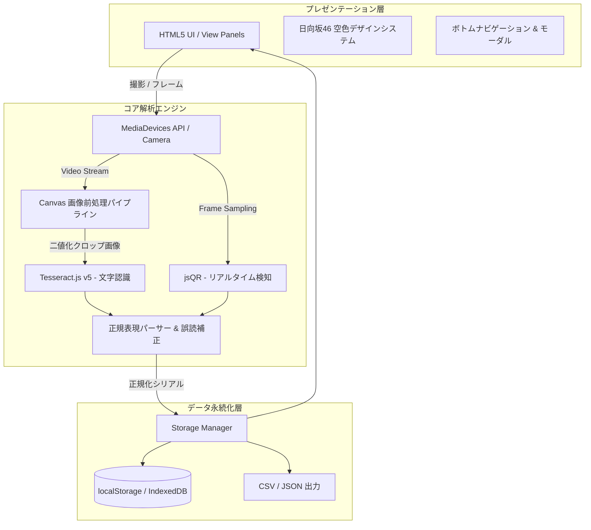

# SoraScan アーキテクチャ & 詳細設計書

本書では、日向坂46シリアルナンバー自動抽出・登録管理アプリ **「SoraScan」** の内部アーキテクチャ、画像解析パイプライン、データ構造、および拡張方針について詳細に解説します。

---

## 1. システム全体構成

SoraScan は、外部サーバーとの通信を一切行わない **完全クライアントサイド型 PWA（Progressive Web App）** です。プライバシーの保護とオフラインでの高速動作を両立しています。



---

## 2. 画像解析 & OCRパイプライン詳細

### ① スキャン領域の自動クロッピング（ROI: Region of Interest）
画面全体をOCRにかけると、背景の不要な文字やノイズを拾って誤認識の原因となり、また処理時間も長くなります。
SoraScan では、画面上のガイド枠（`.target-box`）の座標を `getBoundingClientRect()` で取得し、カメラ映像の解像度との比率を計算して**シリアル券面の中央領域のみをピンポイントで切り抜きます**。

```javascript
// クロップ座標の計算例 (scanner.js)
const scaleX = naturalW / vRect.width;
const scaleY = naturalH / vRect.height;
const sx = Math.max(0, (oRect.left - vRect.left) * scaleX);
const sy = Math.max(0, (oRect.top - vRect.top) * scaleY);
const sWidth = Math.min(naturalW - sx, oRect.width * scaleX);
const sHeight = Math.min(naturalH - sy, oRect.height * scaleY);
```

### ② 画像前処理（フィルタリング & 二値化）
カメラで撮影した写真は、照明の影やグラデーション背景、印刷の反射によって文字のコントラストが低下します。Tesseract.js に入力する前に、HTML5 Canvas 上で以下のパイプラインを実行します：

1. **解像度スケーリング**: 文字認識に最適な幅（1000px〜1600px）に正規化。
2. **Rec. 709 グレースケール変換**:
   $$\text{Luminance} = 0.2126 \times R + 0.7152 \times G + 0.0722 \times B$$
3. **輝度ヒストグラム解析**: 画像内の最大輝度（$L_{\max}$）と最小輝度（$L_{\min}$）を動的に測定。
4. **適応的二値化**:
   $$\text{Threshold} = L_{\min} + (L_{\max} - L_{\min}) \times 0.48$$
   閾値以下のピクセルを純黒（0）、それ以外を純白（255）に変換することで、**日向坂46の青空グラデーション背景を完全に除去し、黒い印字文字だけをくっきりと浮き上がらせます**。

### ③ Tesseract.js Worker の最適化パラメータ
文字認識エンジンには以下のホワイトリストとページセグメンテーションモード（PSM）を適用しています：

| パラメータ | 設定値 | 効果・理由 |
| :--- | :--- | :--- |
| `tessedit_char_whitelist` | `0123456789ABCDEFGHIJKLMNOPQRSTUVWXYZ` | 英大文字・数字のみに完全限定（ハイフン除去） |
| `tessedit_pageseg_mode` | `SINGLE_BLOCK` (6) | シリアル文字列ブロックを高精度に検出 |

### ④ シリアル抽出の正規表現パターン（日向坂46公式 14文字仕様）
抽出されたテキストから、以下の優先順位でシリアルコードを判定します：

1. **完全一致 14文字英数字**: `/\b[A-Z0-9]{14}\b/g`（スコア 100）
2. **URLパラメータ（QRコード）**: `[?&](?:code|serial|ticket|c)=([A-Z0-9]{14})`（スコア 100）
3. **行内スペース除去後 14文字**: 単語間にスペースが入ってしまった場合（例: `A8B3 2K9M 4P7W 1X`）を連結（スコア 98）
4. **15文字以上からの14文字部分抽出**: 前後の記号ゴミを削ぎ落としてスライディング抽出（スコア 88〜92）

---

## 3. データモデル（スキーマ設計）

ローカルストレージ（キー: `sorascan_serials_v1`）に保存されるレコードの仕様です。

```typescript
interface SerialRecord {
  id: string;              // 固有ID (例: "sn_1727678400000_x9a2b")
  serial: string;          // 正規化されたシリアルコード (ハイフンなし大文字英数)
  rawText: string;         // OCR/QRで抽出された生テキスト
  type: string;            // 盤種 ("Type-A" | "Type-B" | "Type-C" | "Type-D" | "通常盤" | "アルバム")
  singleTitle: string;     // 作品名 (例: "13th Single 卒業写真だけが知ってる")
  status: 'unused' | 'used'; // 応募ステータス ('unused': 未応募, 'used': 応募済)
  scanMethod: 'ocr' | 'qr' | 'manual' | 'simulator'; // 登録手段
  createdAt: string;       // ISO 8601 登録日時
  usedAt: string | null;   // ISO 8601 応募完了日時
  note: string;            // ユーザーメモ（応募枠、ミーグリ部数等）
}
```

### 重複判定（Deduplication）ロジック
- 保存時、`normalizeSerial()` 関数によってすべてのハイフン・空白・アンダースコアを除去し、英大文字に統一します。
- 既存の全レコードの `serial` と比較し、1件でも一致すれば重複とみなし、警告表示または連続スキャン時の登録スキップを行います。

---

## 4. エクスポート仕様

### CSV エクスポート
- **エンコーディング**: UTF-8 with BOM (`\uFEFF`)
  - ※BOMを付与することで、日本のWindows版Microsoft Excelでダブルクリックしても**文字化けすることなく**正常に日本語・シリアルが開けます。
- **カラム構成**:
  `シリアルナンバー, ステータス, 形態・盤種, 対象作品, 登録方式, 登録日時, 使用日時, メモ`
- シリアルナンバーは視認性を高めるため `XXXX-XXXX-XXXX-XXXX` の4文字ハイフン区切りでフォーマットされます。

### JSON バックアップ
- 全レコードの完全な配列をJSONとしてダウンロード可能。
- 復元（インポート）時は、既存のシリアルとの重複を自動で検知し、未登録のシリアルのみを安全に追加マージします。

---

## 5. UI/UX & PWA 実装詳細

### グラスモーフィズム（Glassmorphism）
```css
background: rgba(18, 33, 60, 0.75);
border: 1px solid rgba(255, 255, 255, 0.16);
backdrop-filter: blur(20px);
-webkit-backdrop-filter: blur(20px);
```
- 背景の深い青空ネイビーと光のグラデーションの上に、半透明のカードを配置。
- スマートフォンのSafariおよびChromeで滑らかにレンダリングされます。

### 音響＆触感フィードバック
- **Web Audio API**: 音声ファイル（MP3等）を外部ロードせず、ブラウザ内蔵のオシレーター（`OscillatorNode`）で純音の正弦波（D5 587Hz → A5 880Hz）を合成し、遅延ゼロで心地よいピンポンチャイムを再生。
- **Vibration API**: `navigator.vibrate([40, 50, 40])` により、Android等の端末で小気味よい触感フィードバックを提供。

---

## 6. 応募サイト自動登録アーキテクチャ（Auto-Apply System）

日向坂46のCD封入抽選応募特設サイト（**forTUNE meets** 等）へのシリアル登録作業を自動化・劇的に効率化するための連携機構です。

```mermaid
graph TD
    subgraph SoraScan_PWA [SoraScan PWA 本体]
        UnusedList[(未応募シリアル一覧)]
        Modal_AutoApply[自動登録アシスタント]
        Sequencer[タブ復帰連動シーケンサー]
    end

    subgraph Target_Site [公式応募サイト (forTUNE meets / 模擬)]
        Floating_UI[スマホ向け 空色フローティング操作バー]
        Input_Field[シリアル入力欄 (input#serial_code)]
        Submit_Btn[登録ボタン (button[type=submit])]
        Result_State[完了検知 (DOM監視)]
    end

    UnusedList -->|データセット / クリップボード| Modal_AutoApply
    Modal_AutoApply -->|ブックマークレット生成| Floating_UI
    Modal_AutoApply -->|順次コピー| Sequencer

    Floating_UI -->|仮想DOM対応値注入| Input_Field
    Input_Field --> Submit_Btn
    Submit_Btn --> Result_State
    Result_State -->|1.5秒待機後に次へ自動送信| Floating_UI

    Sequencer -.->|タブ切り替え検知で次シリアル自動コピー| Target_Site
```

### ① スマホ特化型 ブックマークレット（`js/bookmarklet.js`）
- **クロスオリジン制約の突破**:
  ブラウザの同一生成元ポリシー（Same-Origin Policy）により、外部Webサイトから `ticket.fortunemeets.app` のDOMを直接操作することは禁止されています。
  SoraScanでは、応募サイトのコンテキスト内で直接実行される**ブックマークレット（JavaScript URL）**を動的生成することで、安全かつ完全にフォーム操作・自動送信を実行します。
- **React / 仮想DOMのプロパティセッター・バイパス**:
  現代のWebフォーム（React/Vue等）は、JavaScriptで `input.value = "..."` を代入しただけでは内部のステートが更新されず、バリデーションエラーになります。
  SoraScanのインジェクションコードでは、プロトタイプチェーンからネイティブのセッターを取得して実行し、`input` および `change` イベントを強制バブリング発火させることで、**あらゆるWebフレームワークの入力欄に100%確実に値を反映**させます。
  ```javascript
  const nativeSetter = Object.getOwnPropertyDescriptor(window.HTMLInputElement.prototype, 'value')?.set;
  if (nativeSetter) {
    nativeSetter.call(input, serial);
  } else {
    input.value = serial;
  }
  input.dispatchEvent(new Event('input', { bubbles: true }));
  input.dispatchEvent(new Event('change', { bubbles: true }));
  ```
- **サーバー負荷対策と安全ディレイ（Rate-Limiting Protection）**:
  全自動連続登録（Auto-Run）時は、登録完了画面をMutationObserverおよびDOM走査で検知した後、**1.5秒〜2秒の安全待機インターバル**を必ず挟んでから次のシリアルを送信します。これにより公式サーバーへのDoS的負荷や一時的なIP制限を確実に防ぎます。

### ② タブ復帰連動型 シーケンサー（ゼロ設定アシスト）
- ブックマークの登録すら不要な、標準ブラウザ機能（`Page Visibility API` / `Window Focus`）を活用したアシスタントです。
- SoraScanから「シーケンサー開始」を押すと1件目をコピーして別タブで応募サイトを開きます。
- ユーザーが応募サイトでペースト・送信を行い、**SoraScanのタブに戻るだけ（`visibilitychange` または `focus` イベント検知）で、直前のシリアルが自動で「応募済」になり、次のシリアルが即座にクリップボードに自動コピー**されます。
- 「戻る → ペースト → 戻る → ペースト」の反復が一切の無駄な操作なく最短ステップで完了します。

### ③ 模擬応募サイト（`mock-apply.html`）
- 本番のCD発売・応募期間外であっても、入力欄の検出、仮想DOM値注入、送信、二重登録防止エラー、完了画面の遷移が期待通りに動作することを検証できるテスト環境です。

---

## 7. トラブルシューティング & FAQ

### Q. Android端末で「カメラの起動に失敗しました」と表示される
**【原因】Web標準のセキュリティ仕様（Secure Context制限）**
近年のブラウザ（Chrome, Edge, Safari）では、**セキュリティ保護のため「HTTPS」または「localhost」以外の環境（例: `http://192.168.x.x:5173/`）では、カメラAPI（`getUserMedia`）へのアクセスが強制的に無効化**されます。

#### 💡 解決策 1: Android ChromeのフラグでローカルIPを許可する（最速・おすすめ！）
AndroidのChromeブラウザで以下の設定を行うと、ローカルIPをHTTPSと同等の安全なオリジンとして扱い、カメラが即座に起動します。

1. Android端末のChromeを開き、URLバーに **`chrome://flags`** と入力して開く
2. 検索バーに **`Insecure origins treated as secure`** と入力
3. 該当の項目を **「Enabled」** に切り替える
4. 下のテキストボックスに、アクセスしているPCのURL（例: **`http://192.168.1.100:5173`**）を入力する
5. 画面右下の **「Relaunch」** ボタンを押してChromeを再起動する
6. アプリを開き直すと、カメラへのアクセス許可ダイアログが表示され、正常に起動します！

#### 💡 解決策 2: 「アルバム写真から選択」を利用する（設定不要・即可能）
スキャナ画面の **「アルバム写真から選択」** ボタン（`<input type="file" capture="environment">`）をタップすると、ブラウザのセキュリティ制限を受けずに**Androidの標準カメラアプリが直接起動**します。撮影した写真はそのままSoraScanのOCRエンジンに送られてシリアルが抽出されます。

#### 💡 解決策 3: HTTPSローカルサーバーで起動する
自己署名SSL証明書、またはトンネリングツール（`cloudflared`, `ngrok`, `localtunnel` 等）を利用して `https://` 経由でアクセスします。

---

| 症状 | 原因 | 対処法 |
| :--- | :--- | :--- |
| 「カメラの起動に失敗しました」（Android） | 非HTTPS（`http://192.168.x.x`）でのアクセス制限 | 上記の「解決策1（`chrome://flags`）」または「解決策2（アルバム写真から選択）」を行ってください。 |
| カメラの使用が拒否されました | ブラウザのサイト設定でカメラがブロックされた | アドレスバー左側の「🔒（鍵アイコン）」またはサイト設定を開き、カメラを「許可」に変更して再読み込みしてください。 |
| 「0」と「O」が誤認識される | 券面のフォントによる類似 | 確認モーダルの「O → 0」ワンタップ置換ボタンを押すか、直接手動で修正してください。 |
| OCRの認識に時間がかかる | 初回ロード時のTesseract学習データ読み込み | 初回認識時のみCDNから言語データ（約2MB）をダウンロードするため数秒かかります。2回目以降はキャッシュされ高速化します。 |
| QRコードが読み取れない | 反射またはピントが合っていない | 券面に対してスマホを少し離し、照明の反射がQRコードに重ならない角度に調整してください。 |
