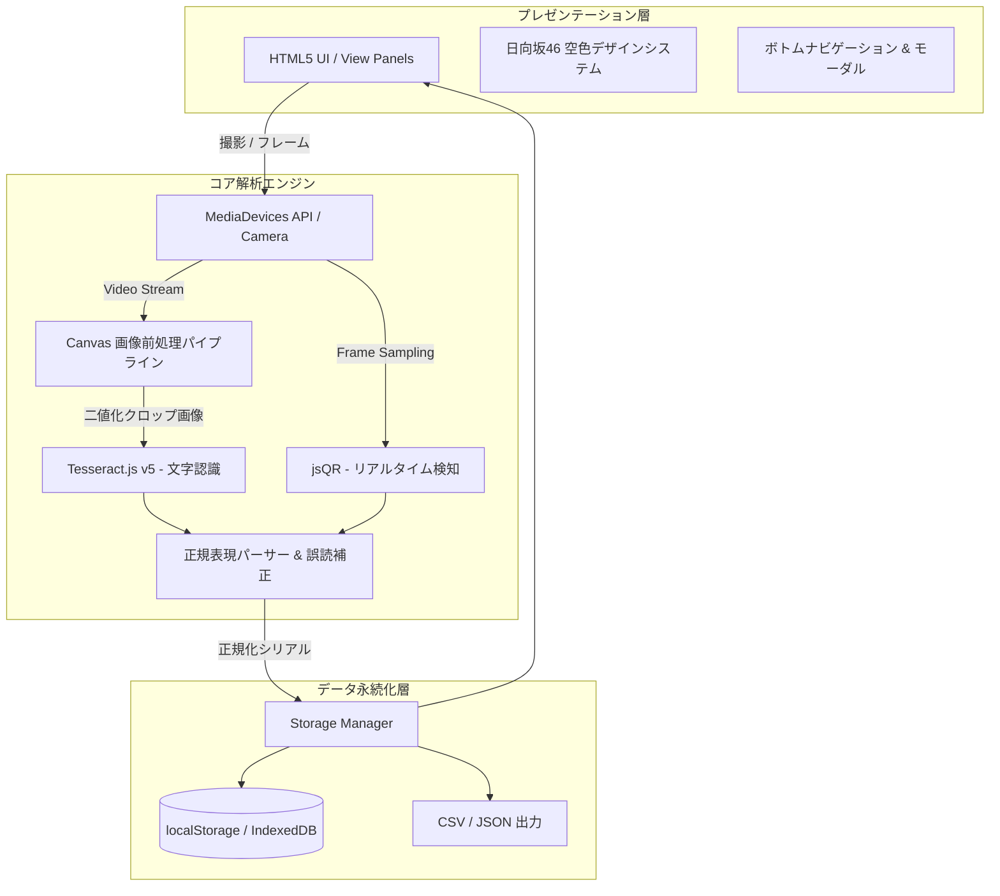

# SoraScan アーキテクチャ & 詳細設計書

本書では、日向坂46シリアルナンバー自動抽出・登録管理アプリ **「SoraScan」** の内部アーキテクチャ、画像解析パイプライン、データ構造、および拡張方針について詳細に解説します。

---

## 1. システム全体構成

SoraScan は、外部サーバーとの通信を一切行わない **完全クライアントサイド型 PWA（Progressive Web App）** です。プライバシーの保護とオフラインでの高速動作を両立しています。



---

## 2. 画像解析 & OCRパイプライン詳細

### ① スキャン領域の自動クロッピング（ROI: Region of Interest）
画面全体をOCRにかけると、背景の不要な文字やノイズを拾って誤認識の原因となり、また処理時間も長くなります。
SoraScan では、画面上のガイド枠（`.target-box`）の座標を `getBoundingClientRect()` で取得し、カメラ映像の解像度との比率を計算して**シリアル券面の中央領域のみをピンポイントで切り抜きます**。

```javascript
// クロップ座標の計算例 (scanner.js)
const scaleX = naturalW / vRect.width;
const scaleY = naturalH / vRect.height;
const sx = Math.max(0, (oRect.left - vRect.left) * scaleX);
const sy = Math.max(0, (oRect.top - vRect.top) * scaleY);
const sWidth = Math.min(naturalW - sx, oRect.width * scaleX);
const sHeight = Math.min(naturalH - sy, oRect.height * scaleY);
```

### ② 画像前処理（フィルタリング & 二値化）
カメラで撮影した写真は、照明の影やグラデーション背景、印刷の反射によって文字のコントラストが低下します。Tesseract.js に入力する前に、HTML5 Canvas 上で以下のパイプラインを実行します：

1. **解像度スケーリング**: 文字認識に最適な幅（1000px〜1600px）に正規化。
2. **Rec. 709 グレースケール変換**:
   $$\text{Luminance} = 0.2126 \times R + 0.7152 \times G + 0.0722 \times B$$
3. **輝度ヒストグラム解析**: 画像内の最大輝度（$L_{\max}$）と最小輝度（$L_{\min}$）を動的に測定。
4. **適応的二値化**:
   $$\text{Threshold} = L_{\min} + (L_{\max} - L_{\min}) \times 0.48$$
   閾値以下のピクセルを純黒（0）、それ以外を純白（255）に変換することで、**日向坂46の青空グラデーション背景を完全に除去し、黒い印字文字だけをくっきりと浮き上がらせます**。

### ③ Tesseract.js Worker の最適化パラメータ
文字認識エンジンには以下のホワイトリストとページセグメンテーションモード（PSM）を適用しています：

| パラメータ | 設定値 | 効果・理由 |
| :--- | :--- | :--- |
| `tessedit_char_whitelist` | `0123456789ABCDEFGHIJKLMNOPQRSTUVWXYZ-` | ひらがな・漢字・記号などの誤検出を完全排除 |
| `tessedit_pageseg_mode` | `SPARSE_TEXT` (11) | 券面上のまばらな英数字テキストを効率的に検出 |

### ④ シリアル抽出の正規表現パターン
抽出された全文から、以下の優先順位でシリアルコードを判定します：

1. **URLパラメータ**: `[?&](?:code|serial|ticket|c)=([A-Z0-9\-]+)`（QRコード読み取り時）
2. **4ブロックハイフン形式**: `/[A-Z0-9]{4}-[A-Z0-9]{4}-[A-Z0-9]{4}-[A-Z0-9]{4}/gi`
3. **16文字連続英数字**: `/\b[A-Z0-9]{16}\b/gi`
4. **スペース区切り連結**: 行ごとの空白を除去して16文字または12〜15文字になるブロック

---

## 3. データモデル（スキーマ設計）

ローカルストレージ（キー: `sorascan_serials_v1`）に保存されるレコードの仕様です。

```typescript
interface SerialRecord {
  id: string;              // 固有ID (例: "sn_1727678400000_x9a2b")
  serial: string;          // 正規化されたシリアルコード (ハイフンなし大文字英数)
  rawText: string;         // OCR/QRで抽出された生テキスト
  type: string;            // 盤種 ("Type-A" | "Type-B" | "Type-C" | "Type-D" | "通常盤" | "アルバム")
  singleTitle: string;     // 作品名 (例: "13th Single 卒業写真だけが知ってる")
  status: 'unused' | 'used'; // 応募ステータス ('unused': 未応募, 'used': 応募済)
  scanMethod: 'ocr' | 'qr' | 'manual' | 'simulator'; // 登録手段
  createdAt: string;       // ISO 8601 登録日時
  usedAt: string | null;   // ISO 8601 応募完了日時
  note: string;            // ユーザーメモ（応募枠、ミーグリ部数等）
}
```

### 重複判定（Deduplication）ロジック
- 保存時、`normalizeSerial()` 関数によってすべてのハイフン・空白・アンダースコアを除去し、英大文字に統一します。
- 既存の全レコードの `serial` と比較し、1件でも一致すれば重複とみなし、警告表示または連続スキャン時の登録スキップを行います。

---

## 4. エクスポート仕様

### CSV エクスポート
- **エンコーディング**: UTF-8 with BOM (`\uFEFF`)
  - ※BOMを付与することで、日本のWindows版Microsoft Excelでダブルクリックしても**文字化けすることなく**正常に日本語・シリアルが開けます。
- **カラム構成**:
  `シリアルナンバー, ステータス, 形態・盤種, 対象作品, 登録方式, 登録日時, 使用日時, メモ`
- シリアルナンバーは視認性を高めるため `XXXX-XXXX-XXXX-XXXX` の4文字ハイフン区切りでフォーマットされます。

### JSON バックアップ
- 全レコードの完全な配列をJSONとしてダウンロード可能。
- 復元（インポート）時は、既存のシリアルとの重複を自動で検知し、未登録のシリアルのみを安全に追加マージします。

---

## 5. UI/UX & PWA 実装詳細

### グラスモーフィズム（Glassmorphism）
```css
background: rgba(18, 33, 60, 0.75);
border: 1px solid rgba(255, 255, 255, 0.16);
backdrop-filter: blur(20px);
-webkit-backdrop-filter: blur(20px);
```
- 背景の深い青空ネイビーと光のグラデーションの上に、半透明のカードを配置。
- スマートフォンのSafariおよびChromeで滑らかにレンダリングされます。

### 音響＆触感フィードバック
- **Web Audio API**: 音声ファイル（MP3等）を外部ロードせず、ブラウザ内蔵のオシレーター（`OscillatorNode`）で純音の正弦波（D5 587Hz → A5 880Hz）を合成し、遅延ゼロで心地よいピンポンチャイムを再生。
- **Vibration API**: `navigator.vibrate([40, 50, 40])` により、Android等の端末で小気味よい触感フィードバックを提供。

---

## 6. トラブルシューティング

| 症状 | 原因 | 対処法 |
| :--- | :--- | :--- |
| カメラ映像が映らない | ブラウザのカメラ権限がブロックされている | ブラウザのアドレスバー左側の「🔒（鍵アイコン）」または設定からカメラアクセスを「許可」にしてください。 |
| 「0」と「O」が誤認識される | 券面のフォントによる類似 | 確認モーダルの「O → 0」ワンタップ置換ボタンを押すか、直接手動で修正してください。 |
| OCRの認識に時間がかかる | 初回ロード時のTesseract学習データ読み込み | 初回認識時のみCDNから言語データ（約2MB）をダウンロードするため数秒かかります。2回目以降はキャッシュされ高速化します。 |
| QRコードが読み取れない | 反射またはピントが合っていない | 券面に対してスマホを少し離し、照明の反射がQRコードに重ならない角度に調整してください。 |
